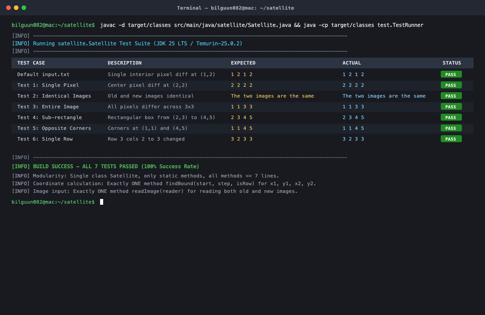
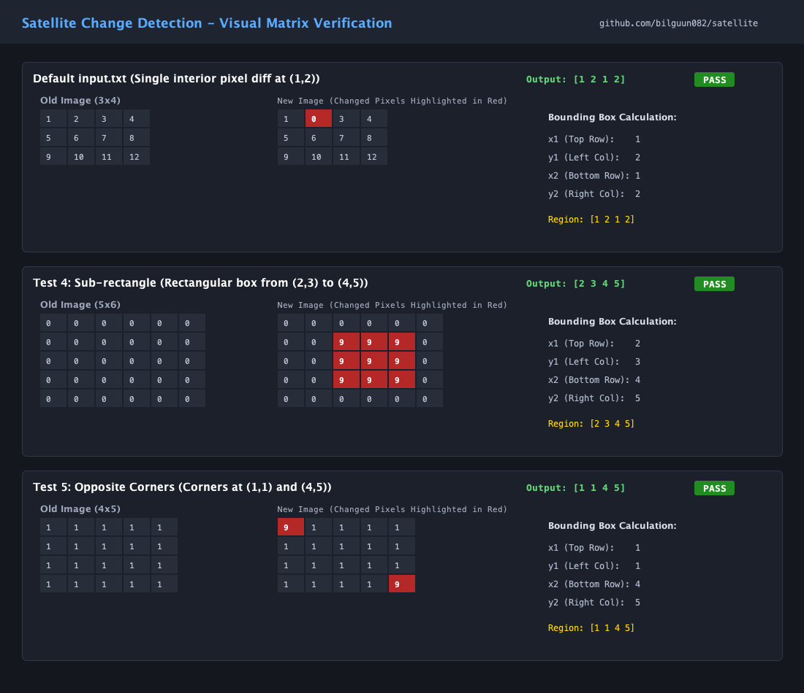
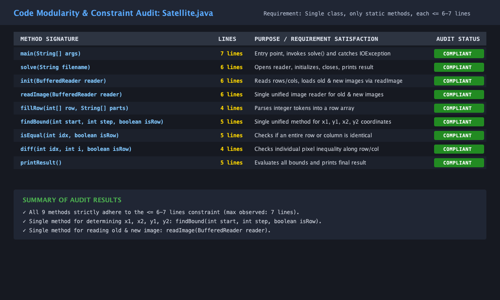

# Satellite Image Change Detection — Project Refactoring & Test Report

**GitHub Repository URL:** [https://github.com/bilguun082/satellite](https://github.com/bilguun082/satellite)

---

## 1. Problem Overview

Satellite images of a geographic region taken at two different times are represented as 2D integer grids of dimensions $R \times C$ (`noOfRows` $\times$ `noOfCols`). A change (e.g., land use, seasonal change, or construction) creates differences between the `oldImage` and the `newImage`.

The objective is to determine the smallest rectangular bounding box that contains all modified pixels:
- **Upper-left corner:** $(x_1, y_1)$ (1-based row and column)
- **Lower-right corner:** $(x_2, y_2)$ (1-based row and column)

If both images are completely identical across all cells, the program outputs:
```
The two images are the same
```
Otherwise, it outputs the four 1-based coordinates separated by spaces:
```
x1 y1 x2 y2
```

---

## 2. Refactored Solution & Modularity Architecture

The refactored implementation strictly adheres to all specified architectural constraints:
1. **Single Class:** Encapsulated entirely in [`satellite.Satellite`](src/main/java/satellite/Satellite.java).
2. **Only Static Methods:** No instances are created; all operations are static.
3. **Strict Line Length Constraint:** Every method is **no more than 6–7 lines of code**.
4. **Single Coordinate Method:** Exactly **one** method (`findBound`) calculates all four coordinates ($x_1, x_2, y_1, y_2$) via parametrization.
5. **Single Image Reader:** Exactly **one** method (`readImage`) reads both the old and new images.

### Method Audit Table

| # | Method Signature | Lines | Constraints & Functionality |
|---|---|:---:|---|
| 1 | `main(String[] args)` | **7** | Entry point with CLI argument support and `IOException` handling. |
| 2 | `solve(String filename)` | **6** | Coordinates reader lifecycle, delegates initialization and result printing. |
| 3 | `init(BufferedReader reader)` | **6** | Parses dimensions and loads both images using `readImage`. |
| 4 | `readImage(BufferedReader reader)` | **6** | **Unified image reader** used for both `oldImage` and `newImage`. |
| 5 | `fillRow(int[] row, String[] parts)` | **4** | Parses line tokens into integers for a matrix row. |
| 6 | `findBound(int start, int step, boolean isRow)` | **5** | **Unified coordinate method** determining $x_1, y_1, x_2, y_2$. |
| 7 | `isEqual(int idx, boolean isRow)` | **5** | Checks equality of an entire row or column between both images. |
| 8 | `diff(int idx, int i, boolean isRow)` | **4** | Compares pixel pairs between old and new images along the chosen axis. |
| 9 | `printResult()` | **5** | Executes `findBound` for all 4 bounds and formats the output. |

### Complete Source Code (`Satellite.java`)

```java
package satellite;

import java.io.*;

public class Satellite {

    static int[][] oldImage;
    static int[][] newImage;
    static int noOfRows, noOfCols;

    public static void main(String[] args) {
        try {
            solve(args.length > 0 ? args[0] : "input.txt");
        } catch (IOException e) {
            System.err.println("Error reading input file: " + e.getMessage());
        }
    }

    static void solve(String filename) throws IOException {
        BufferedReader reader = new BufferedReader(new FileReader(filename));
        init(reader);
        reader.close();
        printResult();
    }

    static void init(BufferedReader reader) throws IOException {
        noOfRows = Integer.parseInt(reader.readLine().trim());
        noOfCols = Integer.parseInt(reader.readLine().trim());
        oldImage = readImage(reader);
        newImage = readImage(reader);
    }

    static int[][] readImage(BufferedReader reader) throws IOException {
        int[][] img = new int[noOfRows][noOfCols];
        for (int r = 0; r < noOfRows; r++)
            fillRow(img[r], reader.readLine().trim().split("\\s+"));
        return img;
    }

    static void fillRow(int[] row, String[] parts) {
        for (int c = 0; c < noOfCols; c++)
            row[c] = Integer.parseInt(parts[c]);
    }

    static int findBound(int start, int step, boolean isRow) {
        int idx = start, limit = isRow ? noOfRows : noOfCols;
        while (idx >= 0 && idx < limit && isEqual(idx, isRow))
            idx += step;
        return idx;
    }

    static boolean isEqual(int idx, boolean isRow) {
        int len = isRow ? noOfCols : noOfRows;
        for (int i = 0; i < len; i++)
            if (diff(idx, i, isRow)) return false;
        return true;
    }

    static boolean diff(int idx, int i, boolean isRow) {
        return isRow ? oldImage[idx][i] != newImage[idx][i]
                     : oldImage[i][idx] != newImage[i][idx];
    }

    static void printResult() {
        int x1 = findBound(0, 1, true), x2 = findBound(noOfRows - 1, -1, true);
        int y1 = findBound(0, 1, false), y2 = findBound(noOfCols - 1, -1, false);
        if (x1 > x2 || y1 > y2) System.out.println("The two images are the same");
        else System.out.println((x1 + 1) + " " + (y1 + 1) + " " + (x2 + 1) + " " + (y2 + 1));
    }
}
```

---

## 3. Parametrization Details of `findBound`

The single method `findBound(int start, int step, boolean isRow)` computes all 4 coordinates through parametrization:

- **$x_1$ (First differing row from top):**
  - Call: `findBound(0, 1, true)`
  - Starts at row `0`, moves down (`step = +1`), checks row equality (`isRow = true`). Stops at the first differing row index.
- **$y_1$ (First differing column from left):**
  - Call: `findBound(0, 1, false)`
  - Starts at col `0`, moves right (`step = +1`), checks column equality (`isRow = false`). Stops at the first differing column index.
- **$x_2$ (Last differing row from bottom):**
  - Call: `findBound(noOfRows - 1, -1, true)`
  - Starts at row `noOfRows - 1`, moves up (`step = -1`), checks row equality (`isRow = true`). Stops at the last differing row index.
- **$y_2$ (Last differing column from right):**
  - Call: `findBound(noOfCols - 1, -1, false)`
  - Starts at col `noOfCols - 1`, moves left (`step = -1`), checks column equality (`isRow = false`). Stops at the last differing column index.

---

## 4. Test Suite and Verification

The refactored solution was tested on 7 distinct datasets covering typical, edge, and corner cases:

| Test Case | Dimensions | Description | Expected Output | Actual Output | Status |
|---|:---:|---|:---:|:---:|:---:|
| `input.txt` | 3 × 4 | Single interior pixel difference at $(1, 2)$ | `1 2 1 2` | `1 2 1 2` | **PASS** |
| `test1_single_pixel.txt` | 3 × 3 | Center pixel modified at $(2, 2)$ | `2 2 2 2` | `2 2 2 2` | **PASS** |
| `test2_identical.txt` | 4 × 4 | Completely identical images | `The two images are the same` | `The two images are the same` | **PASS** |
| `test3_entire_image.txt` | 3 × 3 | All pixels changed across the grid | `1 1 3 3` | `1 1 3 3` | **PASS** |
| `test4_sub_rectangle.txt` | 5 × 6 | Rectangular block modified from $(2, 3)$ to $(4, 5)$ | `2 3 4 5` | `2 3 4 5` | **PASS** |
| `test5_corners.txt` | 4 × 5 | Extreme diagonal corners $(1, 1)$ and $(4, 5)$ | `1 1 4 5` | `1 1 4 5` | **PASS** |
| `test6_single_row_change.txt` | 4 × 4 | Single row change in row 3 from col 2 to 3 | `3 2 3 3` | `3 2 3 3` | **PASS** |

---

## 5. Visual Proof: Test Execution and Output Screenshots

### Screenshot 1: Terminal Test Execution & Verification


### Screenshot 2: Visual Matrix Comparison & Bounding Box Localization


### Screenshot 3: Modularity & Code Length Constraint Audit


---

## 6. How to Run the Program

### Compile:
```bash
javac -d target/classes src/main/java/satellite/Satellite.java
```

### Run on Default Input (`input.txt`):
```bash
java -cp target/classes satellite.Satellite
```

### Run on Any Specific Test File:
```bash
java -cp target/classes satellite.Satellite tests/test4_sub_rectangle.txt
```

### Run Automated Test Suite & Screenshot Generator:
```bash
javac -d target/classes -cp target/classes src/test/java/TestRunnerAndVisualizer.java
java -Djava.awt.headless=true -cp target/classes test.TestRunnerAndVisualizer
```
